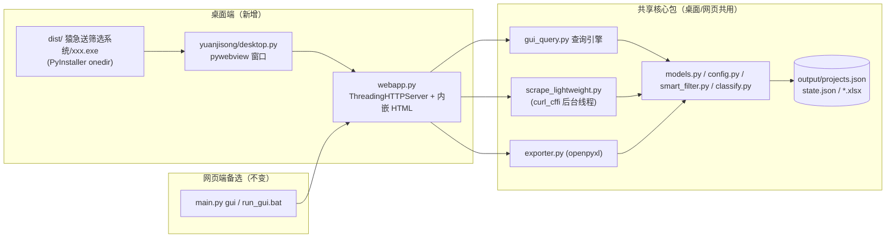

## 需求概述

为「猿急送兼职项目智能筛选爬虫系统」新增桌面端应用打包与生成能力，网页端（现有 `python main.py gui` 浏览器方案）保留为备选方案。桌面端以基础功能可用、稳定运行为主，不追求华丽界面。

## 已确认的决策

1. **技术栈**：Python（curl_cffi / openpyxl / 标准库 http.server），桌面壳采用 pywebview，打包采用 PyInstaller
2. **目标系统**：仅 Windows（本机可直接验证）
3. **功能范围**：全部功能含爬虫——浏览/搜索/筛选/详情/排序/导出 Excel/重新爬取（curl_cffi 一并打包，安装包约 50-70MB 可接受）
4. **共享模块**：完整复用 `yuanjisong/` 核心包（webapp 界面、gui_query 查询引擎、models/models 解析、smart_filter、classify、exporter、scrape_lightweight）与 `output/` 数据目录，桌面端与网页端零逻辑分叉
5. **性能要求**：无硬性要求；PyInstaller 单目录（onedir）打包，启动 1-3 秒可接受

## Core Features

- 桌面端入口：`python main.py desktop` 启动 pywebview 原生窗口，内嵌现有 webapp 界面
- 打包产物：PyInstaller 打出 Windows 桌面应用（`猿急送筛选系统` 目录，含启动 exe），双击即用、免装 Python
- 一键构建脚本：`build_desktop.bat` 自动完成依赖安装与打包
- 网页端备选：现有 `gui` 子命令与 `run_gui.bat` 保持不变

## Tech Stack

- 桌面壳：`pywebview`（Windows 默认 Edge WebView2 后端，Win10/11 系统自带 WebView2 运行时）
- 打包：`PyInstaller`（onedir 模式，`--windowed` 无控制台窗口）
- 复用：现有 `yuanjisong/webapp.py`（http.server 本地服务）、`gui_query.py`、`models.py`、`scrape_lightweight.py`（curl_cffi）、`exporter.py`（openpyxl）——全部零改动或仅小改动

## Implementation Approach

**策略**：桌面端 = pywebview 原生窗口 + 后台线程运行现有 webapp 本地 HTTP 服务。不重写任何界面与业务逻辑，桌面端与网页端共享同一套代码与 `output/` 数据。

关键决策与理由：

1. **webapp.run 小重构而非新写服务启动逻辑**：当前 `webapp.run(host, port, open_browser)` 以 `server.serve_forever()` 阻塞并自选空闲端口（已有 candidate 循环）。将其拆出可复用的启动函数（在后台 daemon 线程启动 server、返回 `server` 与实际 `url`），`run()` 原有行为不变（浏览器模式照旧阻塞+自动开浏览器）——向后兼容，避免复制逻辑（DRY）。
2. **pywebview 窗口壳**：新增 `yuanjisong/desktop.py`，先在 daemon 线程启动 webapp 服务，再 `webview.create_window(url)`；窗口关闭即进程退出、daemon 线程自动结束，资源释放干净。遵循项目「依赖按需加载、缺失给出提示」的既有惯例：未安装 pywebview 时打印安装指引而非崩溃。
3. **PyInstaller 打包要点**：

- `--collect-all curl_cffi`（含 libcurl 等 DLL），`--collect-all openpyxl`、`--collect-all webview`（Windows 后端 winforms/edgechromium 需作为 hidden import，pythonnet/clr_loader 二进制随包）
- onedir + windowed：启动快、无控制台；不做 UPX 等激进优化（用户无硬性要求）
- **frozen 路径处理**：打包后 `output/` 数据目录应落在 exe 同级目录。在 `config.py` 中检测 `sys.frozen`，将 `OUTPUT_DIR` 锚定到 exe 所在目录，保证数据在应用目录下持久化、爬虫断点续爬状态不丢。

4. **性能与可靠性**：数据一次性载入内存（~2100 条毫秒级响应，现有机制）；爬取走后台线程 + 状态轮询（现有机制）；ThreadingHTTPServer 仅监听 127.0.0.1（安全）；端口冲突已有自动换端口逻辑。

## Architecture



## Directory Structure

```
yuanjisong-scrape/
├── yuanjisong/
│   ├── webapp.py        # [MODIFY] 从 run() 中拆出可复用的启动函数（后台线程启动 server 并返回 server+url），run() 行为保持不变
│   ├── desktop.py       # [NEW]  pywebview 桌面壳：后台线程启动 webapp 服务 → 创建原生窗口；pywebview 缺失时给出安装提示；窗口关闭即退出
│   ├── cli.py           # [MODIFY] 新增 desktop 子命令（与 gui 并列，gui 保留为网页端备选）
│   └── config.py        # [MODIFY] sys.frozen 检测：打包后将 OUTPUT_DIR/DATA_JSON/STATE_JSON 锚定到 exe 同级目录
├── desktop_app.py       # [NEW] PyInstaller 入口薄壳（import yuanjisong.desktop 并启动，含窗口标题/尺寸设置）
├── yuanjisong.spec      # [NEW] PyInstaller spec：onedir + windowed；hidden imports（webview.platforms.winforms / edgechromium、clr_loader、pythonnet）；collect curl_cffi / openpyxl / webview 数据与二进制；排除 pytest 等无用依赖
├── build_desktop.bat    # [NEW] 一键构建：venv 检查 → 安装 pywebview/pyinstaller → pyinstaller yuanjisong.spec → 输出产物路径提示
├── requirements.txt     # [MODIFY] 追加 pywebview>=5（pyinstaller 作为构建期依赖写注释或可选段）
└── README.md            # [MODIFY] 新增「桌面端应用（打包）」章节：构建方法、产物位置、数据目录说明、网页端备选入口
```

## Implementation Notes

- webapp.py 重构保持 `run()` 对外签名与行为完全兼容（`tests/test_webapp.py` 等现有测试不回归）
- PyInstaller 对 curl_cffi 必须用 collect-all，否则运行时报 DLL 加载失败；打包后需真实启动 exe 冒烟验证「读取数据/爬取/导出」三条链路
- 打包时排除 tests/、output/（运行时生成）、.venv；`--windowed` 下 print 日志不可见，desktop 模块内部异常需走 webview 前的 try/except + 消息弹窗（pywebview 可用 `webview.windows[0].evaluate_js` 或简单 MessageBox）
- 窗口最小尺寸与现有左栏+中栏布局匹配（如 1200×800），保证表格可用